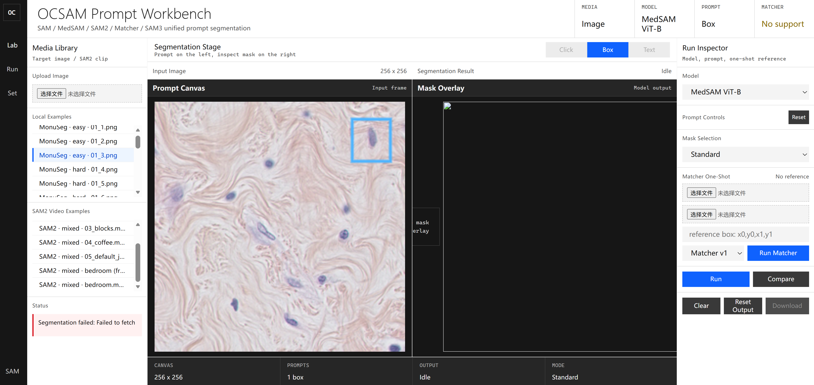

# OCSAM: Medical SAM Prompt Workbench

OCSAM 是一个面向医学图像和视频分割的 SAM 系列复现与实验工作台。当前重点是把 SAM、MedSAM、SAM2、Matcher、SAM3 等方法统一到同一个 promptable segmentation 页面中，并进一步围绕医学图像的自动提示、提示鲁棒性和不确定性分析设计可发表的小项目实验。



## 当前能力

- 统一网页工作台：图像、视频、点击、框选、文本、Matcher reference prompt。
- 模型入口：SAM ViT-B、MedSAM ViT-B、SAM2.1 Tiny、SAM3、Matcher one-shot。
- 视频模式：SAM2 首帧点击/框选提示后传播。
- Matcher 模式：参考图像 + 可选参考 mask；没有 mask 时使用 reference box 生成矩形支持掩码。
- 研究文档：Phase 1 复现实验台、Phase 2 benchmark 设计、paper2/paper3 阅读笔记。

## 从零配置环境

下面是给新机器/合作者使用的配置流程，不依赖本机已有的 `D:\SAM\conda_envs\sam_gpu`。

### 1. 克隆仓库

```powershell
git clone https://github.com/DurianLoop/OCSAM.git
cd OCSAM
```

如果国内访问 GitHub 较慢，可以先在当前终端设置代理，例如：

```powershell
$env:HTTP_PROXY = "http://127.0.0.1:7897"
$env:HTTPS_PROXY = "http://127.0.0.1:7897"
```

### 2. 创建 Conda 环境

推荐 Python 3.10：

```powershell
conda create -n ocsam python=3.10 -y
conda activate ocsam
```

### 3. 安装 PyTorch

根据自己的 CUDA 版本选择安装命令。CUDA 12.1 示例：

```powershell
pip install torch torchvision --index-url https://download.pytorch.org/whl/cu121
```

如果没有 NVIDIA GPU，可以先用 CPU 版验证页面是否能启动：

```powershell
pip install torch torchvision
```

### 4. 安装 Demo 依赖

```powershell
pip install -r requirements-demo.txt
```

基础网页 demo 使用仓库内置的 `code/segment_anything`，不需要额外安装官方 SAM 包。SAM2、SAM3、Matcher 属于可选增强模型；如果要使用这些模型，需要额外准备对应源码目录和依赖。

### 5. 准备权重

至少需要 SAM ViT-B 权重才能启动默认 demo。请把权重放到：

```text
assets/checkpoints/sam_vit_b.pth
```

PowerShell 下载示例：

```powershell
New-Item -ItemType Directory -Force -Path assets\checkpoints | Out-Null
curl.exe -L -o assets\checkpoints\sam_vit_b.pth https://dl.fbaipublicfiles.com/segment_anything/sam_vit_b_01ec64.pth
```

可选权重和下载入口：

| Model | Expected path | Download |
| --- | --- | --- |
| SAM ViT-B | `assets/checkpoints/sam_vit_b.pth` | [Meta SAM ViT-B](https://dl.fbaipublicfiles.com/segment_anything/sam_vit_b_01ec64.pth) |
| MedSAM ViT-B | `assets/checkpoints/medsam_vit_b.pth` | [MedSAM Google Drive folder](https://drive.google.com/drive/folders/1ETWmi4AiniJeWOt6HAsYgTjYv_fkgzoN?usp=drive_link) |
| SAM2.1 Tiny | `assets/checkpoints/sam2.1_hiera_tiny.pt` | [Meta SAM2.1 Tiny](https://dl.fbaipublicfiles.com/segment_anything_2/092824/sam2.1_hiera_tiny.pt) |
| SAM3 | `assets/checkpoints/sam3_modelscope/sam3.pt` and `assets/checkpoints/sam3_modelscope/config.json` | [ModelScope facebook/sam3 files](https://www.modelscope.cn/models/facebook/sam3/files) |
| Matcher SAM-H | `Matcher/models/sam_vit_h_4b8939.pth` | [Meta SAM ViT-H](https://dl.fbaipublicfiles.com/segment_anything/sam_vit_h_4b8939.pth) |
| Matcher DINOv2 | `Matcher/models/dinov2_vitl14_pretrain.pth` | [DINOv2 ViT-L/14](https://dl.fbaipublicfiles.com/dinov2/dinov2_vitl14/dinov2_vitl14_pretrain.pth) |
| Matcher Semantic-SAM | `Matcher/models/swint_only_sam_many2many.pth` | [Semantic-SAM release](https://github.com/UX-Decoder/Semantic-SAM/releases/download/checkpoint/swint_only_sam_many2many.pth) |

如果只想先运行 SAM 点击/框选 demo，只准备 `sam_vit_b.pth` 即可。

常用下载命令：

```powershell
# SAM2.1 Tiny
curl.exe -L -o assets\checkpoints\sam2.1_hiera_tiny.pt https://dl.fbaipublicfiles.com/segment_anything_2/092824/sam2.1_hiera_tiny.pt

# Matcher required weights
New-Item -ItemType Directory -Force -Path Matcher\models | Out-Null
curl.exe -L -o Matcher\models\sam_vit_h_4b8939.pth https://dl.fbaipublicfiles.com/segment_anything/sam_vit_h_4b8939.pth
curl.exe -L -o Matcher\models\dinov2_vitl14_pretrain.pth https://dl.fbaipublicfiles.com/dinov2/dinov2_vitl14/dinov2_vitl14_pretrain.pth
curl.exe -L -o Matcher\models\swint_only_sam_many2many.pth https://github.com/UX-Decoder/Semantic-SAM/releases/download/checkpoint/swint_only_sam_many2many.pth
```

MedSAM 和 SAM3 的权重入口不是普通直链，建议手动从上表链接下载，然后按表格路径放置。MedSAM 下载后请把主权重文件命名为 `medsam_vit_b.pth`。

### 6. 环境变量

Windows 上建议设置：

```powershell
$env:KMP_DUPLICATE_LIB_OK = "TRUE"
$env:MPLCONFIGDIR = "$PWD\.cache\matplotlib_gpu"
```

`medical_sam_click_app.py` 内部也会设置默认值，所以通常不手动设置也能运行。

## 运行网页 Demo

在 PowerShell 中运行：

```powershell
cd <OCSAM仓库路径>\code
python demos\medical_sam_click_app.py --host 127.0.0.1 --port 7860
```

浏览器打开：

```text
http://127.0.0.1:7860
```

如果端口被占用，可以换成其他端口：

```powershell
python demos\medical_sam_click_app.py --host 127.0.0.1 --port 7865
```

开发机上的完整路径示例：

```powershell
Set-Location D:\SAM\code
D:\SAM\conda_envs\sam_gpu\python.exe demos\medical_sam_click_app.py --host 127.0.0.1 --port 7860
```

默认启动后先加载轻量入口，切换模型时再按需加载对应权重。当前网页主要用于交互式复现和调试，不建议把页面结果直接当作最终 benchmark。

### Demo 支持的交互

- Image：上传医学图像或选择本地样例。
- Video：选择 SAM2 视频样例，做首帧提示后传播。
- Prompt：点击、框选、文本提示。
- Model：SAM ViT-B、MedSAM ViT-B、SAM2.1 Tiny、Matcher、SAM3。
- Matcher：支持 reference image / reference mask / reference box 的 one-shot 入口。

## 目录说明

| 路径 | 作用 |
| --- | --- |
| `code/demos/medical_sam_click_app.py` | 当前 FastAPI + Canvas 统一网页工作台 |
| `code/demos/matcher_oneshot_worker.py` | Matcher one-shot 子进程封装 |
| `code/adapters/` | SAM、MedSAM、SAM2、SAM3、Matcher 的统一适配器接口声明 |
| `code/workbench/` | 工作台模型注册、样本扫描和页面数据源 |
| `requirements-demo.txt` | 外部用户运行网页 demo 的最小依赖 |
| `assets/img.png` | README 使用的 OCSAM 工作台截图 |
| `assets/checkpoints/` | 本地模型权重目录，默认不提交到 Git |
| `docs/phase1_reproduction_workbench.md` | 第一阶段：复现实验台 |
| `docs/phase2_benchmark_plan.md` | 第二阶段第一版 benchmark 草案 |
| `docs/phase2_reconstructed_from_papers.md` | 阅读 paper2 后重构的 Phase 2 方案 |
| `docs/papers3/README.md` | 更适合小项目发表的 SAM 医学分割论文中文笔记 |

## 建议下一步

先做最小闭环实验：

```text
数据集：IDRID 20 张 + MonuSeg 20 张
模型：SAM ViT-B / MedSAM / SAM2 Tiny
提示：GT box / perturbed box / auto centroid point / auto grid point / auto box
指标：Dice / IoU / Boundary F1 / Prompt sensitivity / Runtime
```

完成后再补强基线：

```text
SAM ViT-H
SAM2 stronger checkpoint
SAM3 text prompt
Matcher reference prompt
```

## 注意事项

- `conda_envs/`、`assets/checkpoints/`、数据集、模型权重和评测输出默认不提交到 Git。
- `SAM ViT-B` 和 `SAM2.1 Tiny` 更适合交互 demo，不代表最强基线。
- 正式 benchmark 前应补充强权重核查，避免低估 SAM/SAM2 家族上限。
- 如果页面提示 `Failed to fetch`，优先确认后端命令仍在运行、端口没有被占用、以及浏览器访问地址和 `--port` 一致。
